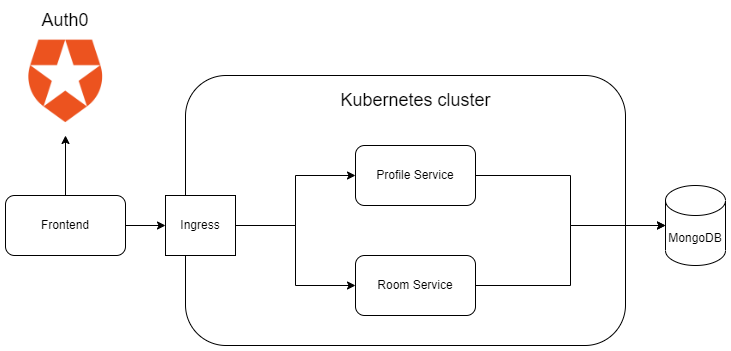
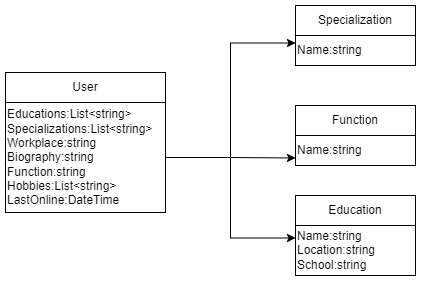

# Architecture

Below you see an image describing the architecture of the Oefenpraktijk application. The frontend is a React application that makes API requests to the Kubernetes cluster, which it can access through the ingress. The ingress then passes the requests to the correct services in the cluster.

## Services

From the previous group we received four services, but because we think this is overkill, we have merged them into two. For new features you can choose to make a new service for them or add them to the existing services.

**Profile service**

Below you can find the class diagram of the profile service. To keep it simple we have left out a few variables. One thing to note is that we use MongoDB, so the classes don't have actual relationships, they are stored as strings in the MongoDB documents.

- A user can have multiple educations, one example being Fontys Toegepaste Psychologie.
- A specialization is a subject in which the user has some expertise. The specializations are the same things as the workspaces in the room service. So an expert in ADHD can give a lecture in the ADHD workspace.
- The workplace is the current place of employment of the user.
- In the biography the user can tell something about themselves.
- In the Netherlands there are several forms of mental health workers and the user can indicate theirs with the function variable. Susan provided us with a list of these forms, please contact us or her if you also want this list.
- In hobbies the user can provide somethings they like to do outside of psychology
- We keep track of which users are online and we use the LastOnline variable to do so.

**Room service**

The room service keeps track of all the workspaces and meetings rooms in those workspaces. A workspace is simply an environment for a single subject, such as ADHD or anxiety. A regular user can make a private meeting room in a workspace to discuss something with a few colleagues, but an admin can make a public room that everybody can join to follow a lecture by an expert.

## Database

To save on costs, the services use the same Mongo database, which is hosted outside of the Kubernetes cluster. We don't host the database within Kubernetes, because we'd need somebody to maintain it (backups, updates, patching etc.) and it is cheaper to let Azure do this. According to the price calculator of Azure, a relational database is quite expensive so we opted for MongoDB instead.
