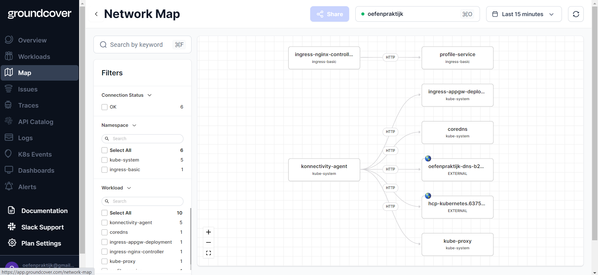

# How do we use monitoring at Oefenpraktijk platform?
## Choice of a monitoring platform?
We chose GroundCover because of its rich developer experience and ease of integration.
The other options were Azure Monitor, DynaTrace, and DataDog. While the last two did not fit our budget requirements, 
Azure Monitor seemed overcomplicated for our context. Another benefit of GroundCover is that it uses eBPF to place a watchdog on every vm in the k8s cluster.
## How to access GroundCover dashboard?
Login to ```https://www.groundcover.com/``` with Oefepraktijk Google account (Please contact one of the former contributers for credentials).
## How can you make use of GroundCover?
To start with, network map offers you a visualisation of your network traffic with network statictics. You can also utilize traces section to track the logs. 
You can also make use of custom dashboards and API catalogs.
## Network Map

