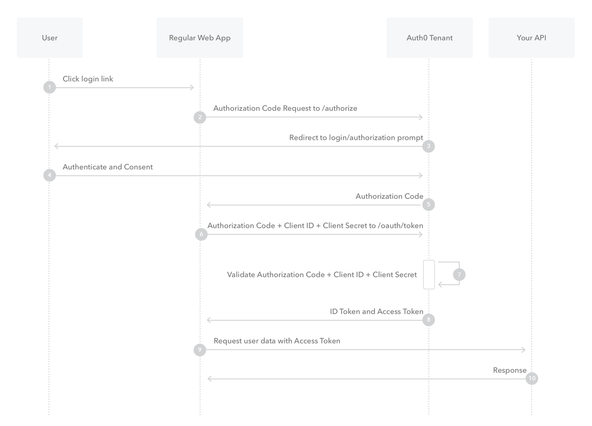

# Introduction
To provide a secure and malware-free experience, we have utilized different techniues for securing the application.

# Context
Oefenparaktijk is a project consisting of web-based application and two microservices. Algthough the backend is structured as microservice architecture, the application works as monolith. To secure the application we wanted to maintain a solution that enforce secure connection to the two backends used in the current version of the project - Room and Profile Services.

# Why Auth0?
## IAM
Securing a system with different components can be challenging task and this is why it is good use a Identity and Access Management (IAM) system to enforce standardization adn following best practices for authentication and authorization.
## Auth0
Auth0 is a well-known IAM provider which provides a free tier with 7k acrive users which is surely enough for a small-to-medium sized platform like Oefenpraktijk. Auth0 follow the last trends in modern security and provides the standard techniques for maintaining authentication and authorization in your project.

# Auth0 Dashboard
In Auth0 the authentication can be a seamless task as Auth0 provides a user-friendly dashboard from where admins can manage their platform's resources like login and registration flows, user managements, application access control, etc.

# Authentication
Auth0 provides a good set of integrations for the main frontend framework and libraries, including React.js, the library used in the project. Auth0 provides registration/login form out of the box while also enable token-based authentication including SSO, e.g. from Google. This makes Auth0 quite good solution for both developers and users. Developers got quite secure and 
flexible components to build their authentication, while users have nice user experience. Auth0 uses OpenID Connect authentication protocol which uses JWT token. You can obtain test tokens from the Auth0 dashboard for testing purposes and in development ad production, you can use the Auth0 components/functions to obtain tokens for the users when they are trying to access certain resource.

# Authorization
## Context
Auth0 uses OAuth2.0 authorization framework which is a de facto in today's auth world, as it provides a way to grant access to a set of resources like user data, or APIs. OAuth2.0 does not define specific token format but JWT can be used which enables storing specific data in the token itself.
To enforce stable authorization flow, you can manage the user roles and permissions through the Auth0 dashboard.
Currently, there two type of roles - user and admin. It is nice new role to be added which represent domain experts, people who held big public meetings within th platform. They would have a little bit more permissions than the basic users - mental health workers, but less than admins. There are few permissions for now that restrict access to certain resources. In order a user to be eligible to access certain resource, they need to have a token containing specific scope corresponding to the permission.

## Flow

Read more [here](https://auth0.com/docs/get-started/authentication-and-authorization-flow/authorization-code-flow)

# Post-registration flow
In section Actions > Flows you can find the Post registration flow containing CreateAccount action. This action is responsible for creating a user account in the Profile database and assing a user role to it.

# How to get test token
You can go to `Dashboard > Applications > APIs > Oefenpraktijk Backend > Test` to obtain test JWT token for the testing the backend.
